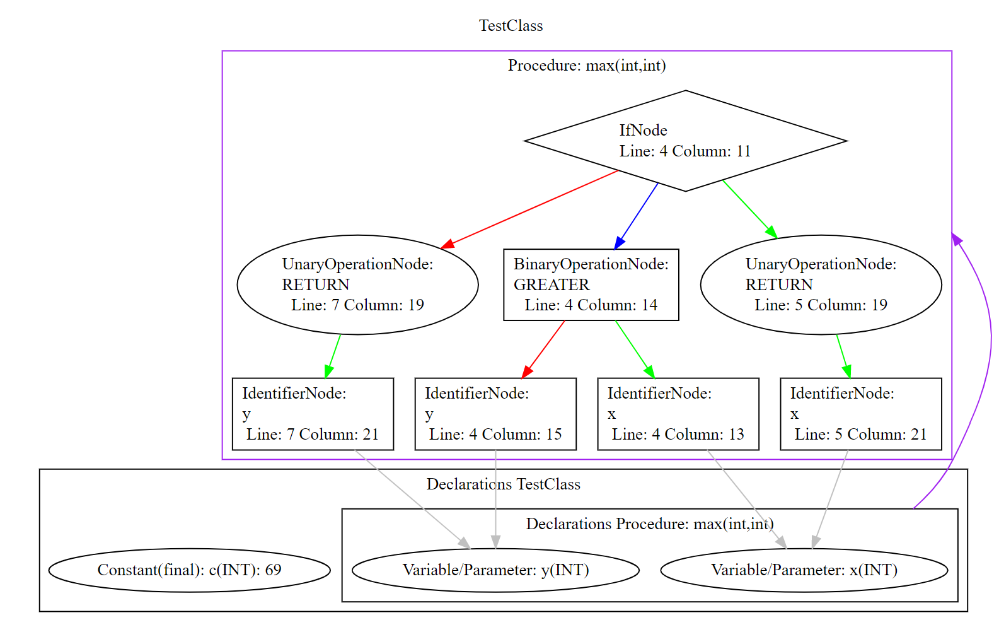

# JavaSST Compiler

Generates a Java-Class file for a given JavaSST Program.
This Project is part of a university course.
JavaSST is a super-super-trivial subset of Java which was developed for education purposes.

## Usage
```
JavaSSTCompiler inputFile [generateDotGraph]
```
The `inputFile` must be a valid path to a File containing JavaSST source code.
If the second parameter `generateDotGraph` is set to `true`, an additional DOT file is created which contains a Graph describing the AST and symbol table. 

## Using the class file
```
java -noverify JavaClassFileUsingCompiled Class
```
The `-noverify` flag is used to circumvent the StackMap usage in higher Java versions.

## Example
Given the following JavaSST Source code
```java
class TestClass{
    final int c = 69;
    public int max(int x, int y){
        if(x>y){
            return x;
        }else{
            return y;
        }
    }
}
```
this compiler generates the following abstract syntax tree and symbol table:

Red and green edges represent left and right child nodes respectively.
Blue edges point towards conditions being used by `if` or `while` statements.
Purple edges point to method declarations. Other edges represent references.

Based on this Graph a Java class file is generated.
This class file contains the following ByteCode (ConstantPool not shown here):
```ByteCode
  public int c;
    descriptor: I
    flags: (0x0001) ACC_PUBLIC

  public int max(int, int);
    descriptor: (II)I
    flags: (0x0001) ACC_PUBLIC
    Code:
      stack=3, locals=5, args_size=3
         0: iconst_0
         1: iload         1
         3: iload         2
         5: if_icmpgt     12
         8: iconst_0
         9: goto          13
        12: iconst_1
        13: if_icmpne     22
        16: iload         2
        18: ireturn
        19: goto          25
        22: iload         1
        24: ireturn
        25: iconst_0
        26: ireturn

  public TestClass();
    descriptor: ()V
    flags: (0x0001) ACC_PUBLIC
    Code:
      stack=2, locals=1, args_size=1
         0: aload_0
         1: invokespecial #19                 // Method java/lang/Object."<init>":()V
         4: aload_0
         5: bipush        69
         7: putfield      #12                 // Field c:I
        10: return
```